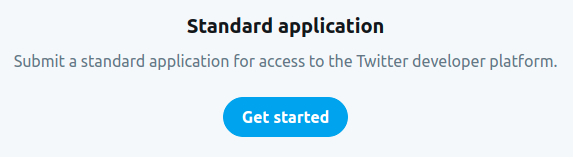
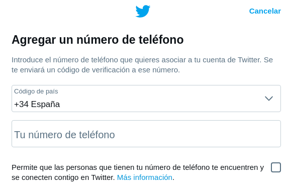
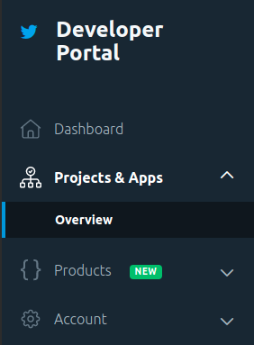

# What I need

1. Create a regular Twitter account and sign in.

2. Go to https://developer.twitter.com/en/portal/dashboard
    

3. Click on "**Hobbyist**".
    

4. Select "**Exploring the API**".
    

5. Click on "**Get started**".
    

6. Click on "**Add a valid phone number**".
    

7. Click on "**Add phone number**".
    

8. Provide you valid phone number.
    

9. Enter the code that you have received in the mobile number.
    

10. You should see something like this:
    

11. Complete the following fields:
    

12. In this field you have to fill in a text in English that contains at least 200 characters.
    

13. In this field you have to fill in a text in English that contains at least 100 characters.
    

14. In this field you have to fill in a text in English that contains at least 100 characters.
    

15. This field must be left disabled.
    

16. And this field too.
    

17. Check this checkbox.
    

18. Click on "**Submit application**".
    

19. Go to "**Projects & Apps**", "**Overview**".
    

20. Click on "**Create App**".
    

21. Put your App name.
    

22. This is very important, keep these codes in a safe place.
    

23. Click on "**App settings**".
    

24. Glick on "**Keys and tokens**".
    

25. Generate a **token** and **secret**.
    

26. This is very important too, keep these codes in a safe place.
    

27. Make sure you have generated the secret and the token with read and write permissions.
    

